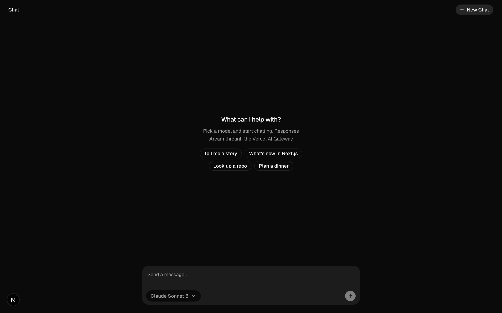
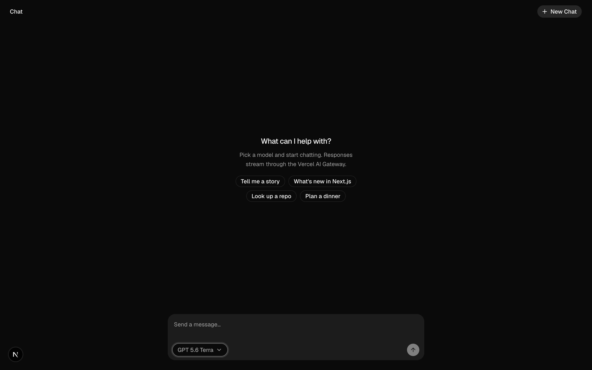

# Verify App

A reusable skill for coding agents that verify application behavior through real user actions.

## What it does

- Discovers project startup commands, available tools, authentication requirements, and shared resources.
- Creates a project verification procedure when one is missing.
- Checks browser flows, CLI commands, APIs, and other public interfaces.
- Captures evidence and separates observed results from untested claims.
- Preserves evidence when test sessions and processes stop.

Start with [SKILL.md](SKILL.md). Project setup instructions are in [references/project-setup.md](references/project-setup.md).

## Example output

### Verify model selection

Real screenshots from a completed local verification run. The agent opened the model menu and selected GPT 5.6 Terra.

| Before the action | After the action |
| --- | --- |
| [](docs/examples/model-selection/before.png) | [](docs/examples/model-selection/after.png) |
| Claude Sonnet 5 is selected. | GPT 5.6 Terra is selected. |

**Result: PASS** — the control displayed the selected model. Reloading restored the default model, as expected for this application.

- **Checked:** model menu, selection, reload behavior, and browser errors.
- **Evidence:** original 2880 × 1800 screenshots passed a fresh file validation check. Select an image for full size.
- **Cleanup:** the test browser and owned server stopped; source checks found no application edits.
- **Not tested:** sending a message, model responses, or deployed behavior. No prompt was submitted.

These images show states before and after a user action. They do not represent a code change or a video recording.
For a visual code change, the same format can compare the original and updated versions.

## Use with a coding agent

Copy this repository into the skill directory supported by your coding agent. Keep the supporting files with SKILL.md.
For agents without skill support, provide SKILL.md as the task instructions and make its references available.
The optional `agents/openai.yaml` file supplies Codex display metadata. Other agents can ignore it.

Example requests:

- "Set up verification for this repository."
- "Verify the changed checkout flow without submitting an order."
- "Check this CLI command and save evidence of its output."

The procedure uses the project's existing tools and commands. It does not require a particular editor or package manager.

## Browser capture and validation

The bundled helper requires macOS or Linux, Python 3, agent-browser 0.38.1 or later, FFmpeg, and ffprobe.
It uses a fixed desktop profile: 1440 × 900 viewport, scale 2, and 2880 × 1800 output.
Video uses H.264 at 60 fps. Supported agent-browser desktop checks must use this helper, including screenshot-only checks.
Run its validator immediately before sharing and use only returned files.
Other tools and mobile capture need a declared procedure with validation checks. Missing validation remains incomplete.

See [browser evidence](references/browser-evidence.md) for commands and limits.
File validation checks media settings and integrity. It does not prove application correctness, sharpness, or smooth motion.

## Tests

```sh
python3 scripts/test_evidence.py
```

Media tests require FFmpeg and ffprobe. The suite reports skipped media tests if those tools are absent.

For helper coverage, install Coverage.py in a separate tool environment, then run:

```sh
python3 -m coverage run --branch --source=scripts scripts/test_evidence.py
python3 -m coverage report --include='*/evidence.py'
python3 -m coverage xml --include='*/evidence.py' -o coverage/coverage.xml
```

Coverage reports are local evaluation files. They are not part of the skill bundle.
